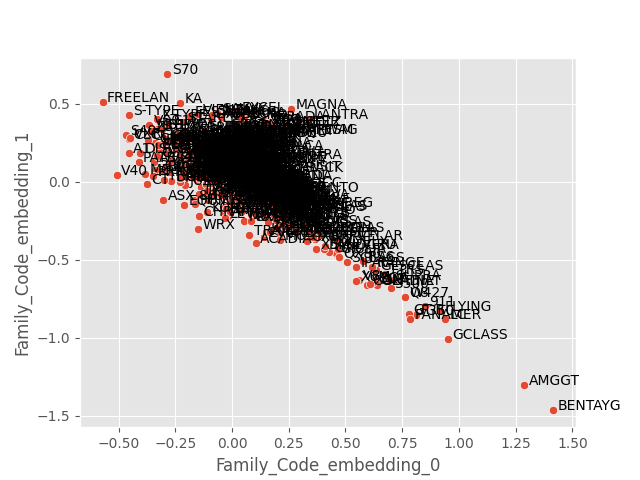
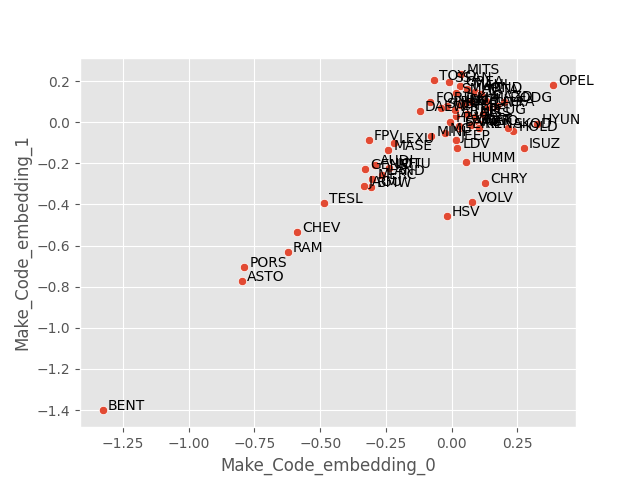
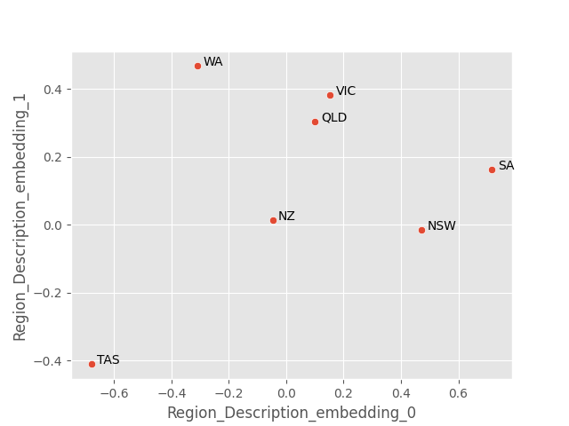
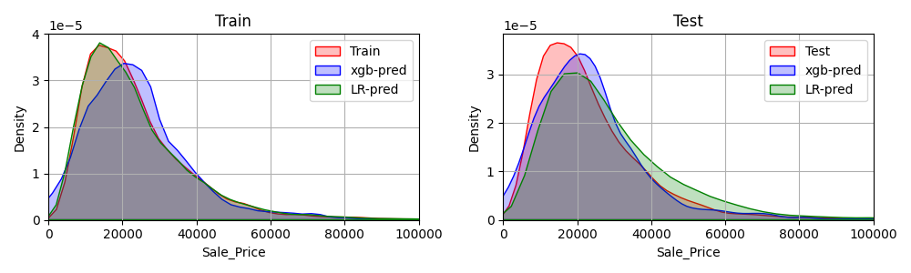
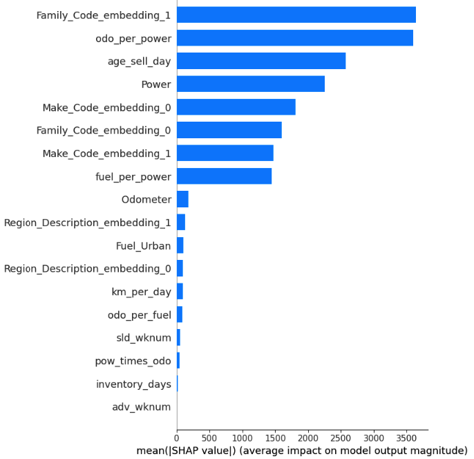
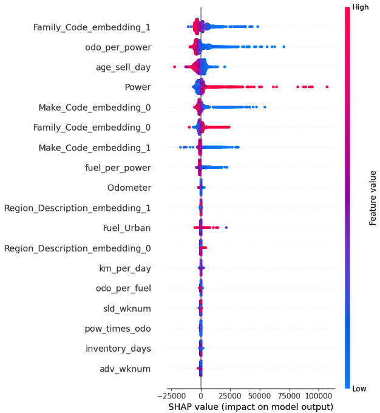
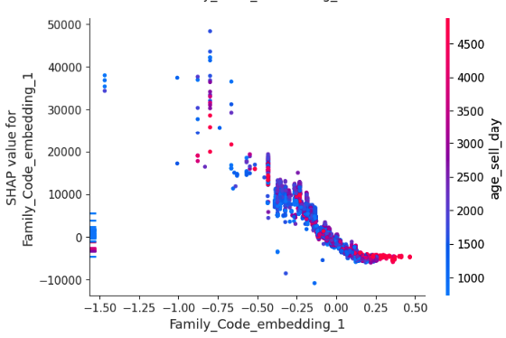
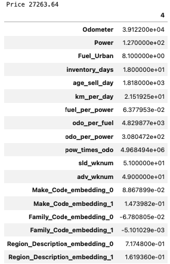
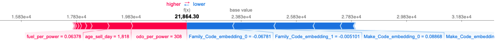

## How to Reproduce

1. `cd` into _root folder_ and follow below
2. `pip install -r requirements.txt`
3. update `config.yml` file if need as the variables will be loaded from it.
4. move data to `data/saleprice_dataset.csv`
5. run `python dataprocess.py` to generate test/train datset
6. run `python make_embeddings.py` to generate embedding in `./data/embeddings.pkl`
7. run train script as  `python train.py` to generate model in `./out/xgb_model.json`, print test results to cli

## Solution Design and Approach

 - Model will be used to predict future car value using the engineered features from dataset.
 - Model serving requires running an inference pipeline every day since some features like age is calculated based on the prediction date.
 - Imputation: New models which were not sold before will always find its way into the market. We use a nearest neighbour imputer to address this issue to classify the car based on the best available features of simillar category. In future with more samples this issue will be automatically resolved.
 - Feature Engineering: We have engineering some fetaures based on the findings from our [EDA](nbs/eda.ipynb). Some of these incorporated features are found to significant driver of the sales price.
 - Scaling & Encoding: scaling not used for xgb model since the split of trees is not affected by scaling. But we have used used sacling while a linear model was built using [ridge regression](nbs/regression.ipynb).
 - Model Selection: We have decided to use a XGB-regression model to conviniently incorporate non-linear interactions of the features, although a regularized linear model was buitl as a baseline with results [shown](#r-2-score-comparison).

### Embeddings

Categorical columns are converted to embeddings using `make_embeddings.py` and the plots below visualizes them for each category.
#### Family Code

#### Make Code

#### Region

## Model Results

### Train - Test split date & summary

Since the model will be used for furture car value predictions, train/test split should be done on a date (Sold date).

- TRAIN Max Date: `2021-12-24`
- TRAIN # of records: 99586
- TEST Max Date: `2022-08-08`
- TEST # of records: 17574

### R-2 Score comparison
| Model     | Train | Test  |
|:----------|:-----:|:-----:|
| Ridge     | 0.785 | 0.679 |
| XG-Boost  | 0.916 | 0.793 |

### Explain Model Features

The feature importance map shows the most relavant features which contribute towards the model prediction. Car's Family seems to be the most deciding factor for its price, along with odometer reading, power and age of the car. It is interesting to note that car family and make has significant impact on its price.

A concise view on how each feature influence sales price.

Figure below shows the PDP for the Family_Code encoding vs age of the car.

 
 
 An example of how a Price is decided by the model

 Example of a record

Depiction of how a price is achieved.

