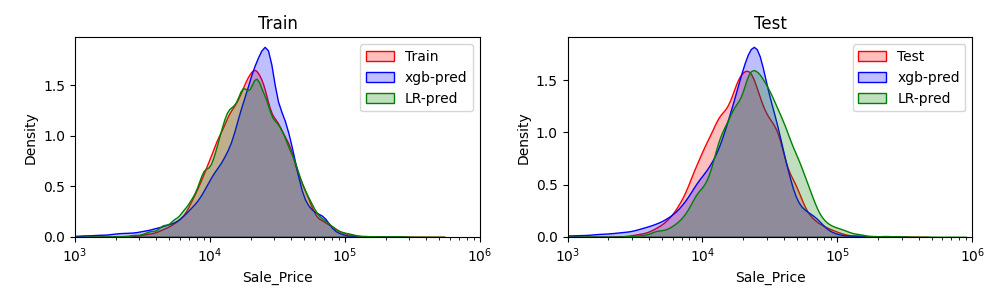

## Solution Design

 - Model will be used to predict future car value.
 
 - Model serving requires running an inference pipeline every day since some features like age is calculated based on the prediction date.

## Solution Approach
 - KNN imputer
 - Feature Engineering
 - Scaling & Encoding: scaling not used for xgb model.

### Embeddings

Categorical columns are converted to embedding using `make_embeddings.py` and the plots below visualizes them for each caegory
#### Family Code

#### Make Code

#### Region

## Model Results

### Train - Test split date & summary

Since the model will be used for furture car value predictions, train/test split should be done on a date (Sold date).

- TRAIN Max Date: `2021-12-24`
- TRAIN # of records: 99586
- TEST Max Date: `2022-08-08`
- TEST # of records: 17574

### R-2 Score comparison
| Model     | Train | Test  |
|:----------|:-----:|:-----:|
| Ridge     | 0.785 | 0.679 |
| XG-Boost  | 0.953 | 0.837 |

### Explain Model Features
 - Show shap value and PDP plots
 - 

## How to Reproduce

1. `cd` into _root folder_ and follow below
2. `pip install -r requirements.txt`
3. update `config.yml` file if need as the variables will be loaded from it.
4. move data to `data/saleprice_dataset.csv`
5. run `python dataprocess.py` to generate test/train datset
6. run `python make_embeddings.py` to generate embedding in `./data/embeddings.pkl`
7. run `python train.py` to generate model in `./out/xgb_model.json`, print test results to cli
